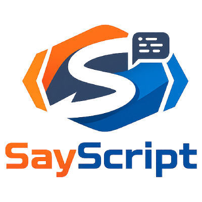
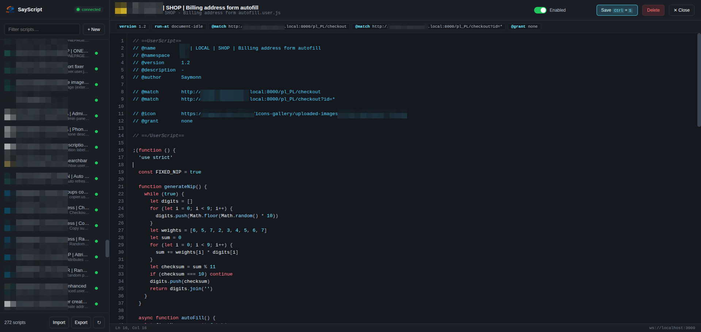

<div align="center">



# SayScript

**A developer-grade userscript manager with real-time, two-way sync between `.user.js` files on disk and your browser.**

Edit a script in the dashboard → the file on disk is overwritten instantly.
Edit a file in your editor (VS Code, Vim, etc.) → the dashboard and every
matching page pick up the change instantly. Drop your Tampermonkey scripts into
`scripts/` and they just work.


<br>



</div>

---

## Why SayScript?

It's a tiny, self-hosted alternative to Tampermonkey aimed at developers who keep
their userscripts **as real files in a git repo / folder** and want to edit them
with their own tools:

- ⚡ **Live two-way sync** over a local WebSocket — UI ⇄ disk, no save buttons to babysit.
- 🧩 **Tampermonkey-compatible** `GM_*` / `GM.*` API, including CORS-free `GM_xmlhttpRequest`.
- 📦 **Import/Export** in Tampermonkey's exact `.zip` backup format.
- 🎨 Built-in dashboard with a syntax-highlighting editor, per-tab toolbar popup, and enable/disable toggles.
- 🔒 100% local. Nothing leaves your machine. No CDN, no telemetry, no account.

> **Heads-up:** this is a personal developer tool, not a Web Store extension. It
> runs unpacked in developer mode and grants itself broad host access on purpose
> (so `GM_xmlhttpRequest` can reach any local/remote API). Use it for your own
> scripts on your own machine.

---

## Requirements

| | |
|---|---|
| **Browser** | Chrome, Edge, or Brave **v120+** (needs the `chrome.userScripts` API) |
| **PHP** | **8.1+** on PATH (`php -v`) |
| **Composer** | Latest ([getcomposer.org](https://getcomposer.org/download/)) |

PHP + Composer are the only dependencies. The single library used (`cboden/ratchet`,
a WebSocket server) is fetched by Composer; everything else is vanilla.

---

## Quick start

### 1. Clone & start the server

**Linux / macOS**

```bash
git clone https://github.com/saymonn37/SayScript.git
cd SayScript
./start.sh
```

**Windows**

```bat
git clone https://github.com/saymonn37/SayScript.git
cd SayScript
start.bat
```

> Or just double-click `start.bat` in Explorer.

The launcher checks PHP/Composer, runs `composer install` on first run, and starts
the server on `ws://localhost:3000`. You should see:

```
================================================
  SayScript server running
  WebSocket : ws://localhost:3000
  Scripts   : .../sayscript/scripts
================================================
```

<details>
<summary>Prefer to run it manually?</summary>

```bash
cd server
composer install
php server.php                       # defaults: port 3000, ../scripts, poll 1.0s
php server.php --port=3001 --dir=/path/to/scripts --interval=0.5
```
</details>

### 2. Load the extension

1. Open `chrome://extensions`.
2. Turn on **Developer mode** (top-right).
3. **Load unpacked** → select the **`extension/`** folder.
4. Open the extension's **Details** page and enable **“Allow user scripts”**
   (Chrome shows this toggle for any extension using the `userScripts` API — it's
   inert without it).
5. Click the **SayScript** toolbar icon → the **Dashboard** opens.

The toolbar badge shows how many enabled scripts run on the current tab, and turns
green when the background worker is connected to the server.

### 3. Add your scripts

Drop any `.user.js` files into the **`scripts/`** folder (or import a Tampermonkey
backup — see below). They appear in the dashboard instantly and inject on matching
pages on the next page load.

---

## Using it

- **Left panel** — your scripts, alphabetical, with their `@icon`. Click the
  **green dot** to enable/disable a script (greys out + strikethrough when off).
  Filter with the search box.
- **+ New** — opens the editor with a template immediately (no name prompt); the
  filename is derived from `@name` on first save and de-duplicated automatically.
- **Editor** — syntax-highlighted JS. **Ctrl/Cmd + S** writes to disk. **Esc** or
  **✕ Close** leaves the editor. The **Enabled** toggle mirrors the list dot.
- **Live reload** — external file changes reload the open script (your unsaved
  edits are never clobbered — you get a warning instead).
- **Toolbar popup** — lists scripts running on the current tab with on/off
  toggles, plus an **Open Dashboard** button.
- **Import / Export** (sidebar footer) — Tampermonkey-compatible `.zip` backups:
  per script a `<Name>.user.js` + `.options.json` + `.storage.json`, plus a
  `Tampermonkey.global.json`. Import restores GM storage values and enabled state.

---

## Tampermonkey compatibility (the `GM` API)

Injected before every script (`extension/gm-polyfill.js`):

| API | Notes |
|-----|-------|
| `GM_xmlhttpRequest`, `GM.xmlHttpRequest` | Routed through the background `fetch()` → **bypasses page CORS** (the extension holds `<all_urls>`). Supports `onload/onerror/onloadend`, `responseType` text/json/arraybuffer/blob, headers, timeout, abort. |
| `GM_setValue` / `GM_getValue` / `GM_deleteValue` / `GM_listValues` | Per-script `chrome.storage.local`. `GM_getValue` is **synchronous** (values embedded into the injection preamble); `GM.*` promise variants also provided. |
| `GM_log`, `unsafeWindow` | `console.log` prefixed with the script name; `unsafeWindow` → `window`. |
| `GM_addStyle`, `GM_openInTab`, `GM_setClipboard`, `GM_registerMenuCommand`, `GM_notification`, `GM_info` / `GM.info` | Practical equivalents. |

---

## Project layout

```
sayscript/
├── start.sh / start.bat     ← one-command setup + launch (Linux·macOS / Windows)
├── scripts/                 ← your *.user.js files (kept out of git; example included)
├── server/                  ← local WebSocket + file-watch backend (PHP / Ratchet)
│   ├── server.php
│   └── composer.json
└── extension/               ← the Chromium MV3 extension (load this unpacked)
    ├── manifest.json
    ├── background.js        ← WS client · userScripts injection · GM bridge
    ├── gm-polyfill.js       ← GM_* / GM.* compatibility layer
    ├── options.*            ← dashboard + editor
    ├── popup.*              ← toolbar popup
    ├── zip.js               ← dependency-free ZIP reader/writer (import/export)
    └── assets/ , icons/     ← logo & icon
```

---

## How it works (and a few MV3 notes)

- **Injection uses the `chrome.userScripts` API**, not `eval` — it runs scripts in
  a CSP-exempt world, honours `@run-at`/match filtering, and (via
  `configureWorld({messaging:true})`) lets the GM polyfill talk to the background
  worker. That's what powers the CORS-free `GM_xmlhttpRequest`. Each script is
  wrapped in its own IIFE so they never collide.
- **The editor is self-contained** — MV3 forbids remote scripts on extension
  pages, so instead of a CDN CodeMirror there's a small offline JS tokenizer.
- **Self-healing** — the worker reconnects with backoff, keeps script state in
  `chrome.storage.local`, and debounces bulk changes (importing hundreds of
  scripts triggers a single re-registration).
- **No echo loops** — a UI save updates the server's snapshot before the watcher
  fires, so it broadcasts only to *other* clients.

**Message protocol (JSON over WS).** Client → server: `fetch_all_scripts`,
`update_script {filename, code}`, `create_script {filename, code?}`,
`delete_script {filename}`, `ping`. Server → client: `all_scripts`,
`script_changed`, `script_deleted`, `update_ack`, `delete_ack`, `pong`, `error`.

---

## Troubleshooting

| Symptom | Fix |
|---|---|
| Badge grey / dashboard says **offline** | The server isn't running, or something else holds port 3000. Restart `./start.sh` (or `start.bat`), or pass `--port=3001`. |
| **Scripts don't inject** | Enable **“Allow user scripts”** on the extension's Details page. Check the service-worker console (`chrome://extensions` → SayScript → *Inspect views: service worker*) for `registered N/M script(s)`. |
| **`GM_xmlhttpRequest` fails** | Use the GM API for cross-origin calls — a plain `fetch()` inside your script is still subject to page CORS. The worker logs the real error in the service-worker console. |
| **Changed `server.php` but nothing changed** | PHP doesn't hot-reload — stop the server (Ctrl+C) and start it again. |
| **Windows: `php` not found** | Install PHP 8.1+ and add its folder to PATH; reopen the terminal. |

---

## Your scripts stay private

The `scripts/` folder is **git-ignored** (`scripts/.gitignore`) except for
`example.user.js`. Your personal userscripts never get committed or published —
clone the repo, drop your own scripts in, and they stay on your machine.

To publish your own fork: `git init`, commit, and push. Replace
`extension/assets/logo.png` (and `extension/icons/icon128.png`) to rebrand.

---

## License

[MIT](LICENSE) © 2026 Szymon Obrzut
